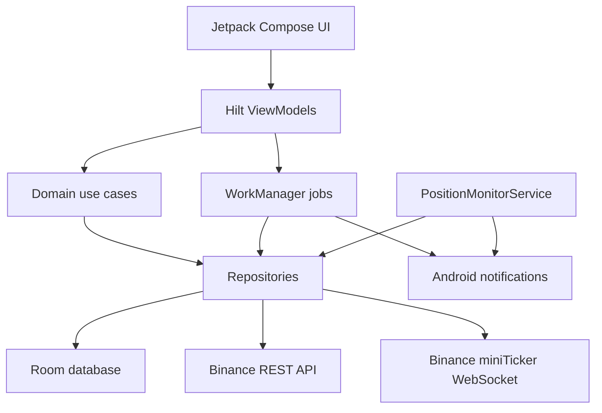

## TradeLab


TradeLab is an Android crypto paper-trading simulator for learning technical analysis and practicing virtual order
flows without sending real trades to an exchange. It combines live Binance market data, simulated portfolio state,
indicator readouts, educational guardrails, and factual notifications for users who want a safer practice environment.
No hosted demo or store listing is configured in this repository.

No screenshots or store assets are currently present in the repository.

## Project Overview

TradeLab helps users explore markets, place simulated orders, review virtual performance, and learn indicator behavior
inside a single Android app. The app is built for learners and hobbyists who need clear educational context, simulated
balances, and explicit warnings that nothing has real monetary value. It uses local persistence for portfolio state and
alerts, while market prices and candles are read from Binance public endpoints.

## Key Features

- 📈 Live markets watchlist with Binance ticker snapshots, WebSocket ticks, favorites, filters, search, and top movers.
- 🕯️ Canvas-based candlestick chart with timeframe chips, zoom/pan support, crosshair semantics, and indicator overlays.
- 🧪 Virtual paper-trading wallet with market orders, limit orders, leverage simulation, TP/SL targets, and reset flow.
- 🔔 Price and indicator alerts with foreground evaluation, periodic WorkManager checks, and notification deep links.
- 📊 History and analytics for filled virtual orders, realized P/L, equity curve, win rate, and maximum drawdown.
- 🧠 Indicator feed for RSI, MACD, moving averages, momentum, methodology explanations, and deterministic backtests.
- 🛡️ Educational disclaimer gate, banned-vocabulary test coverage, and copy that avoids investment-instruction language.
- 💳 Play Billing integration scaffold for pro unlocks and restore-purchase handling.

## Architecture Overview



### Components And Layers

The UI layer is a single-activity Jetpack Compose app with Navigation Compose routes for markets, trade, indicators,
history, learn, alerts, settings, and paywall screens. Hilt ViewModels collect repository flows, invoke domain use cases,
and expose state objects to composables.

The domain layer contains pure Kotlin use cases for virtual order placement, pending limit fills, TP/SL/liquidation
closure, indicator calculation, backtesting, and performance statistics. Repositories isolate persistence, billing,
settings, market data, and alerts.

The data layer stores wallet, positions, orders, pairs, tickers, candles, alerts, indicator readouts, and entitlements in
Room. Market data comes from Binance public REST endpoints and the `!miniTicker@arr` WebSocket stream; no remote write path
exists for trade execution.

### Request And Data Flow

1. The app starts `MainActivity`, creates notification channels in `TradeLabApp`, and shows the disclaimer gate until
   accepted.
2. Foreground lifecycle events start and stop the market WebSocket unless open positions require the foreground monitor.
3. User actions call ViewModel methods, which invoke domain use cases and repositories.
4. Room emits updated flows back to the ViewModels, refreshing Compose state.
5. Alerts, TP/SL checks, daily digest, and position-monitor notifications are handled by WorkManager and foreground
   service components.

### Design Patterns

The codebase uses MVVM, repository boundaries, dependency injection with Hilt, offline-first Room flows, Kotlin coroutines,
and small domain use cases for testable business rules.

## Tech Stack & Libraries

| Layer | Technology | Version | Purpose |
| --- | --- | --- | --- |
| Language | Kotlin | 2.0.21 | Main application language |
| Build | Android Gradle Plugin | 8.7.3 | Android build system |
| UI | Jetpack Compose BOM | 2024.12.01 | Declarative Android UI |
| UI | Material 3 | BOM-managed | App components and theming |
| Navigation | Navigation Compose | 2.8.5 | Single-activity route graph and deep links |
| DI | Hilt | 2.52 | Dependency injection for app, ViewModels, workers, and services |
| Persistence | Room | 2.6.1 | Local database for portfolio, alerts, candles, and market cache |
| Settings | DataStore Preferences | 1.1.1 | Disclaimer, notification, and user preference storage |
| Networking | Retrofit | 2.11.0 | Binance REST API client |
| Networking | OkHttp | 4.12.0 | WebSocket and HTTP transport |
| Serialization | Kotlinx Serialization | 1.7.3 | JSON parsing for remote responses |
| Background work | WorkManager | 2.10.0 | Periodic alert evaluation and daily digest jobs |
| Billing | Play Billing KTX | 7.1.1 | Pro unlock and restore-purchase scaffolding |
| Images | Coil Compose | 2.7.0 | Image loading support |
| Tests | JUnit | 4.13.2 | Unit test runner |
| Tests | MockK | 1.13.13 | Mocks for repository/use-case tests |
| Tests | Kotlinx Coroutines Test | 1.9.0 | Coroutine test utilities |

## Prerequisites

- macOS, Linux, or Windows with Android Studio Ladybug or newer recommended.
- JDK 17 available to Gradle.
- Android SDK with compile SDK 35 installed.
- Android emulator or device running Android 8.0, API 26, or newer.
- Network access to `api.binance.com` and Binance WebSocket endpoints.
- GitHub CLI is optional and only needed for publishing the repository.

| Variable | Required | Default | Description |
| --- | --- | --- | --- |
| `ANDROID_HOME` | Yes | Not configured | Android SDK location when not using Android Studio defaults. |
| `JAVA_HOME` | Recommended | Not configured | JDK 17 location for consistent Gradle builds. |
| `BINANCE_API_BASE_URL` | No | Not configured | Not used; Binance endpoints are configured in source. |
| `PLAY_BILLING_LICENSE_KEY` | No | Not configured | Not present; billing is scaffolded through Google Play Billing APIs. |

## Installation & Setup

1. Clone the repository.

   ```bash
   git clone https://github.com/michaelsam94/TradeLab.git
   cd TradeLab
   ```

2. Make sure the Gradle wrapper is executable on macOS or Linux.

   ```bash
   chmod +x ./gradlew
   ```

3. Open the project in Android Studio or verify the command-line build.

   ```bash
   ./gradlew assembleDebug
   ```

4. Install the debug build on a connected emulator or device.

   ```bash
   ./gradlew installDebug
   ```

5. `.env` setup is not applicable. This Android project does not load a `.env` file.

6. Database setup is automatic. Room creates the local database on first app launch.

7. Development server setup is not applicable. This is a native Android app, not a web app.

## Configuration

Configuration is split across Android and Kotlin source files:

| Location | Purpose | Restart Required |
| --- | --- | --- |
| `app/build.gradle.kts` | App ID, SDK versions, version name/code, build types, Compose, and dependencies. | Rebuild required. |
| `gradle/libs.versions.toml` | Central dependency and plugin versions. | Gradle sync required. |
| `app/src/main/AndroidManifest.xml` | Permissions, deep links, foreground service, receiver, and startup provider config. | Rebuild required. |
| `app/src/main/res/values/strings.xml` | App name, disclaimer copy, navigation labels, and notification rationale copy. | Rebuild required. |
| `app/src/main/res/xml/network_security_config.xml` | Android network security config. | Rebuild required. |
| `local.properties` | Local Android SDK path generated by Android Studio. | Local only; ignored by Git. |

Notification permission is requested at runtime on Android 13 and newer. Foreground service notification channels are
created in `TradeLabApp`.

## Usage / Quick Start

### Build And Run A Debug APK

```bash
./gradlew assembleDebug
./gradlew installDebug
```

After launch, accept the disclaimer gate, open the Markets or Trade tab, and wait for live ticker data to arrive.

### Place A Simulated Market Order

```text
1. Open Trade.
2. Select Buy or Sell.
3. Keep order type set to Market.
4. Enter a USDT amount and choose leverage.
5. Optionally enter take-profit and stop-loss values.
6. Tap Place Virtual Order.
```

The order updates the local virtual wallet and positions only. It never sends an order to Binance or any other exchange.

### Run Unit Tests

```bash
./gradlew testDebugUnitTest
```

The current tests cover order placement, leverage sizing, TP/SL resolution, liquidation behavior, indicator math,
backtest determinism, and banned user-facing vocabulary.

## API Reference

Not applicable. TradeLab is a native Android app and does not expose a public HTTP API, SDK, CLI, or server endpoint.

External data access is read-only and implemented internally through:

| Source | Purpose |
| --- | --- |
| Binance REST `exchangeInfo` | Load supported trading pairs. |
| Binance REST `klines` | Fetch candle history for charts and indicators. |
| Binance REST `ticker24h` | Refresh ticker snapshots for offline cache and workers. |
| Binance WebSocket `!miniTicker@arr` | Stream live ticker updates while the app or position monitor is active. |

## Project Structure

```text
.
├── app/
│   ├── build.gradle.kts                 # Android app module, SDK, dependencies, build types
│   ├── proguard-rules.pro               # Release shrinker rules
│   └── src/
│       ├── main/
│       │   ├── AndroidManifest.xml      # Permissions, activity, service, receiver, deep links
│       │   ├── java/com/michael/tradelab/
│       │   │   ├── data/                # Room, repositories, REST, WebSocket
│       │   │   ├── domain/              # Models, indicators, and use cases
│       │   │   ├── notifications/       # Position-close notification helper
│       │   │   ├── service/             # Foreground position monitor and Stop receiver
│       │   │   ├── ui/                  # Compose screens, navigation, chart, theme
│       │   │   └── worker/              # Periodic alert and digest workers
│       │   └── res/                     # Strings, themes, icons, network config
│       └── test/java/com/michael/tradelab/
│           └── *.kt                     # JVM unit tests
├── gradle/libs.versions.toml            # Version catalog
├── gradlew                              # Gradle wrapper for Unix-like systems
├── gradlew.bat                          # Gradle wrapper for Windows
├── ROADMAP.md                           # Implementation roadmap and feature phases
└── settings.gradle.kts                  # Gradle project settings
```

## Testing

Run all JVM unit tests:

```bash
./gradlew testDebugUnitTest
```

Build the debug APK:

```bash
./gradlew assembleDebug
```

Run Android instrumentation tests when connected to a device or emulator:

```bash
./gradlew connectedDebugAndroidTest
```

Coverage reporting is not configured. Test files live in `app/src/test/java/com/michael/tradelab/` and currently use
JUnit, MockK, and coroutine test utilities. Existing naming convention is descriptive backtick test names inside focused
test classes such as `PlaceVirtualOrderUseCaseTest` and `IndicatorMathTest`.

## Deployment

Docker and docker-compose are not applicable because this is a native Android application.

Release packaging is configured through the Android Gradle Plugin release build type with minification and resource
shrinking enabled:

```bash
./gradlew assembleRelease
```

Signed release distribution is not configured in the repository. To publish through Google Play, add signing
configuration outside version control, configure Play Console app metadata, verify billing products, generate a release
AAB, and upload it through the Play Console.

```bash
./gradlew bundleRelease
```

No production health-check endpoint exists. Runtime health is checked through app startup, successful market-data refresh,
foreground notification behavior, and local test/build verification.

## Contributing

1. Fork the repository and create a feature branch such as `feat/position-monitor` or `fix/alert-copy`.
2. Use Conventional Commits, for example `feat: add alert filter chips` or `fix: stop monitor when positions close`.
3. Keep changes focused and include unit tests for domain logic or regression-prone behavior.
4. Run `./gradlew testDebugUnitTest` and `./gradlew assembleDebug` before opening a pull request.
5. Include screenshots or screen recordings for visible UI changes when possible.

Style rules are primarily enforced by the Kotlin compiler and existing project patterns. A standalone
`docs/CONTRIBUTING.md` file is not currently present.

## Roadmap

- [ ] Add release signing documentation and Play Console publishing checklist.
- [ ] Add Android instrumentation coverage for the disclaimer gate and core trade flows.
- [ ] Add real app screenshots or store graphics under a documented assets directory.
- [ ] Add CI for Gradle unit tests and debug builds.
- [ ] Add configurable market-data provider settings for test and demo environments.

## License

Not configured. No `LICENSE` file is currently present in the repository.

Copyright © 2026 Michael Samir.

## Acknowledgements & Credits

TradeLab is built with Kotlin, Android Jetpack, Jetpack Compose, Material 3, Hilt, Room, WorkManager, DataStore,
Retrofit, OkHttp, Kotlinx Serialization, Coil, and Google Play Billing. Market data is read from Binance public market
data endpoints. The project also uses JUnit, MockK, Turbine, and Kotlinx Coroutines Test for local verification.
